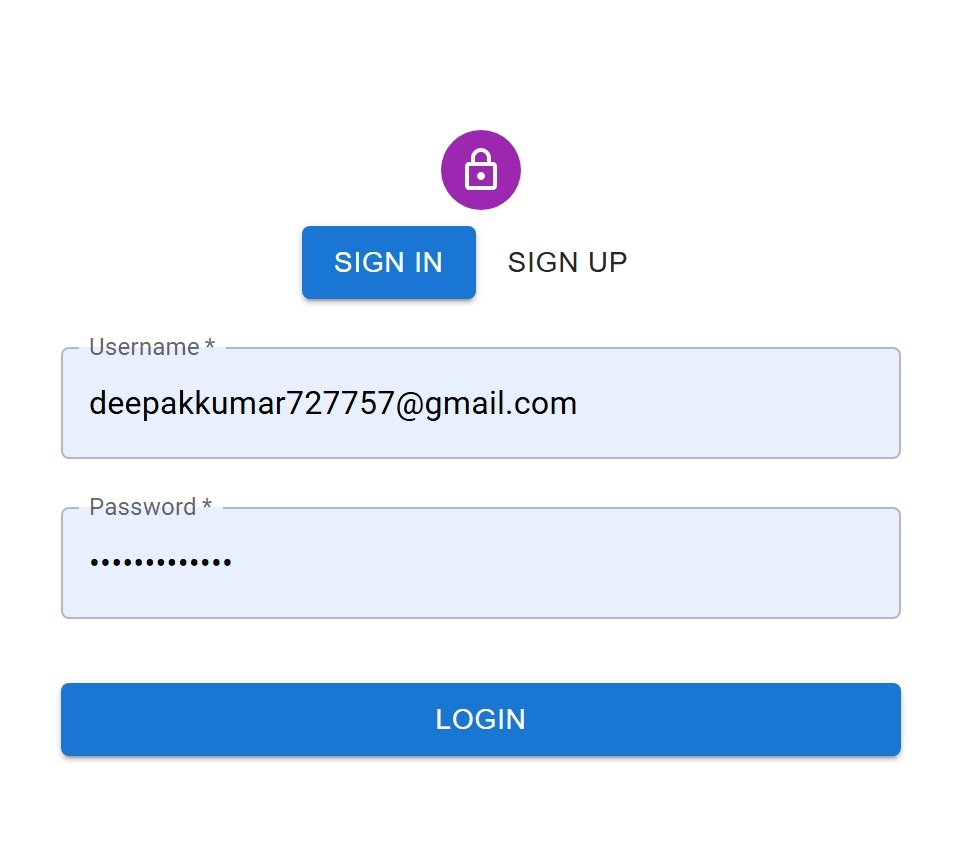
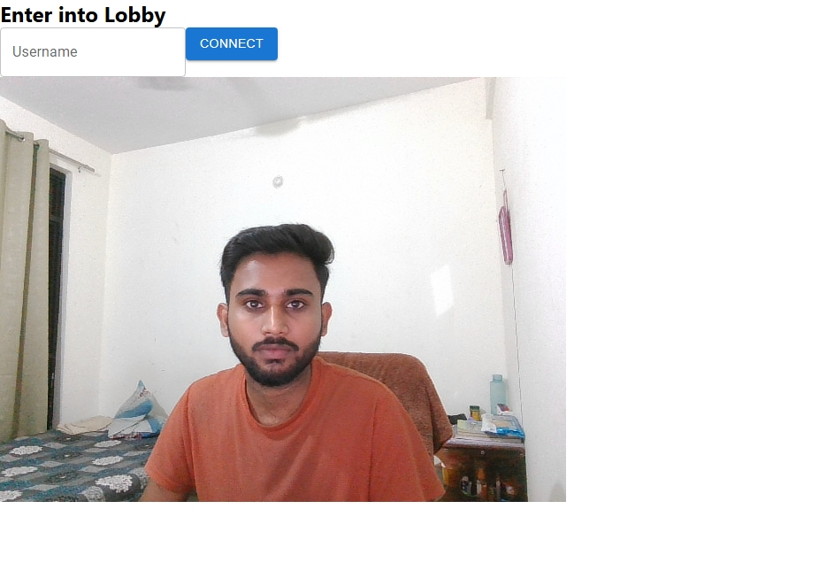

# Real-Time Video Conferencing Platform

A full-stack real-time video conferencing platform that allows users to communicate through video and audio in real time. The application provides user authentication, meeting functionality, and real-time communication using modern web technologies.

## 🚀 Features

- User Registration and Login
- User Authentication and Authorization
- Real-Time Video and Audio Communication
- Create and Join Meetings
- Real-Time Communication using Socket.IO
- WebRTC-based Video Conferencing
- Meeting Management
- Responsive User Interface
- Protected Routes
- MongoDB Database Integration

## 🛠️ Tech Stack

### Frontend
- React.js
- JavaScript
- HTML
- CSS

### Backend
- Node.js
- Express.js
- MongoDB
- Mongoose
- Socket.IO

### Real-Time Communication
- WebRTC
- Socket.IO

### Authentication
- JWT
- Password Hashing

## 📁 Project Structure

```text
Real-Time-Video-Conferencing-Platform/
│
├── backend/
│   ├── src/
│   │   ├── controllers/
│   │   ├── models/
│   │   ├── routes/
│   │   ├── app.js
│   │   └── ...
│   ├── package.json
│   └── package-lock.json
│
├── frontend/
│   ├── public/
│   ├── src/
│   │   ├── contexts/
│   │   ├── pages/
│   │   ├── styles/
│   │   └── ...
│   ├── package.json
│   └── package-lock.json
│
├── screenshots/
│   ├── login.png
│   ├── home.png
│   └── meeting.png
│
├── .gitignore
└── README.md
```

## 📸 Screenshots

### 🔐 Login Page


### 🏠 Home Page


### 🎥 Meeting Page
